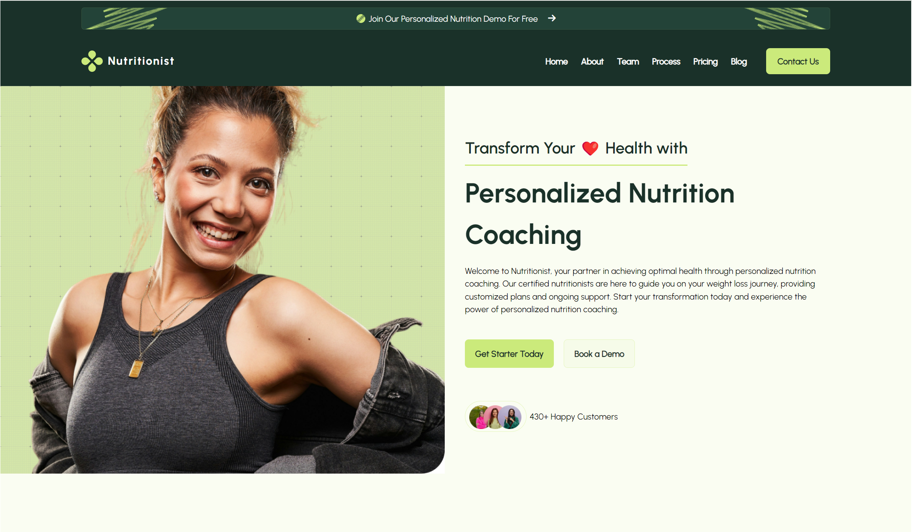
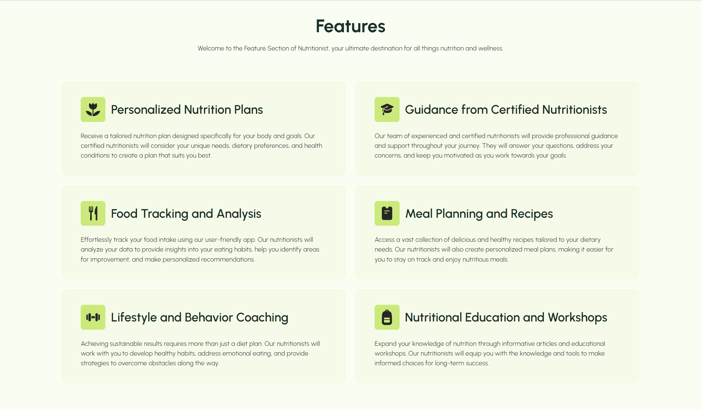
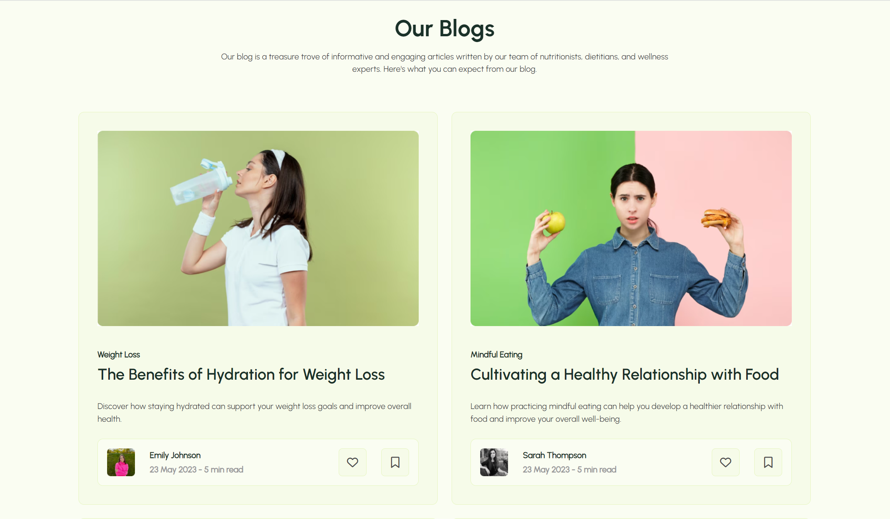
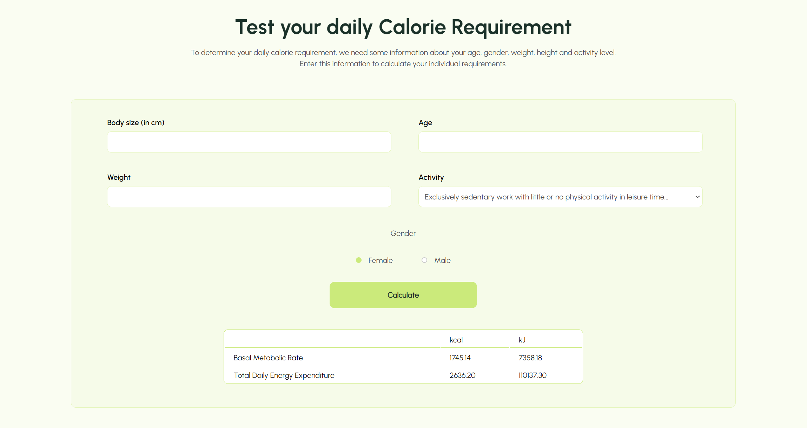
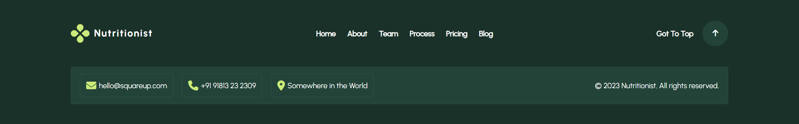

# Abschlussprojekt Frontend Health App

Dieses Projekt ermöglicht die Berechnung des täglichen Energiebedarfs (in Kilokalorien und Kilojoule) basierend auf den Benutzereingaben und enthält zusätzliche interaktive Funktionen wie sanftes Scrollen und die Auswahl des aktiven Tarifs.

## Funktionen

### 1. **Täglicher Energiebedarf Rechner**
   - Der Rechner akzeptiert folgende Eingaben:
     - **Größe** (in Zentimetern)
     - **Alter** (in Jahren)
     - **Gewicht** (in Kilogramm)
     - **Aktivitätsniveau** (ein Multiplikator für die körperliche Aktivität)
     - **Geschlecht** (männlich/weiblich)
   - Er berechnet:
     - **Kalorien (kcal)** und **Kilojoule (kJ)** pro Tag.

### 2. **Sanftes Scrollen**
   - Eine Funktion für sanftes Scrollen zu einem bestimmten Header auf der Seite wird beim Klicken auf einen Button verwendet.

### 3. **Auswahl des aktiven Tarifs**
   - Der Benutzer kann zwischen einem monatlichen und einem jährlichen Tarif wählen. Der ausgewählte Tarif wird auf der Seite angezeigt.

## Kontaktinformationen

Falls Sie Fragen oder Vorschläge haben, können Sie mich kontaktieren:
- **E-Mail**: barshchevskak@gmail.com
- **GitHub**: [TinaBK24](https://github.com/TinaBK24)

## Screenshots

### Hore

### Features

### Blogs

### Calorie

### Footer

