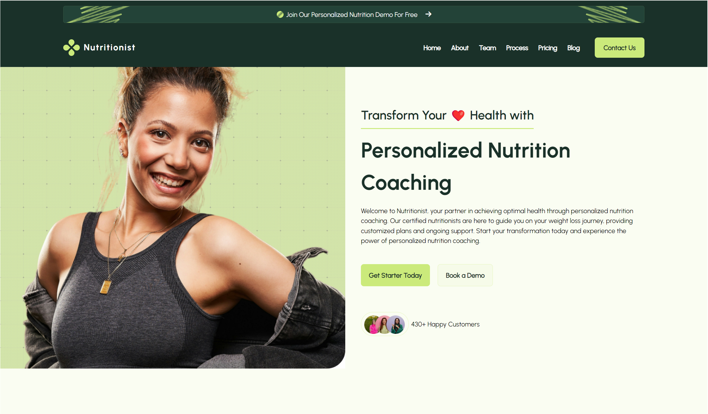
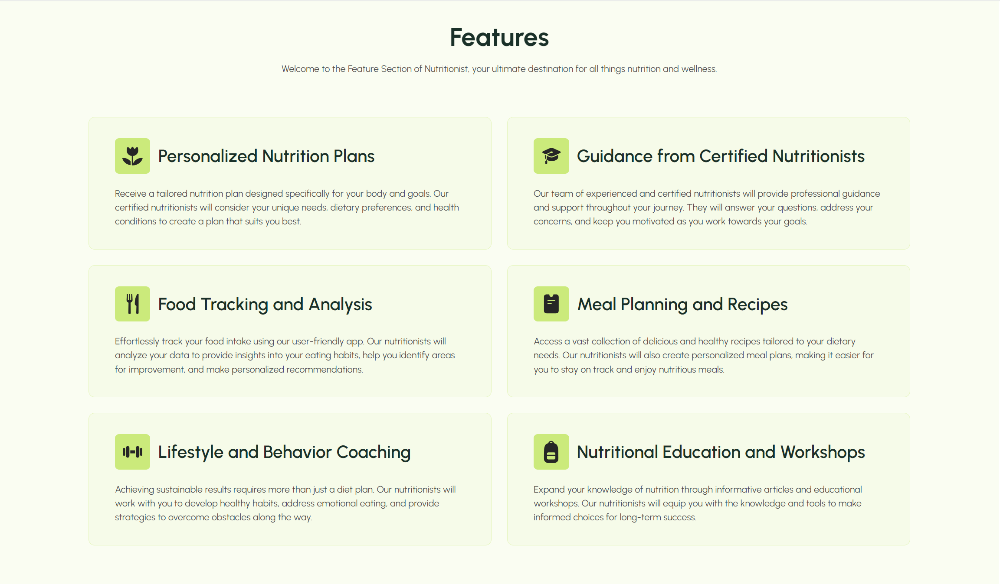
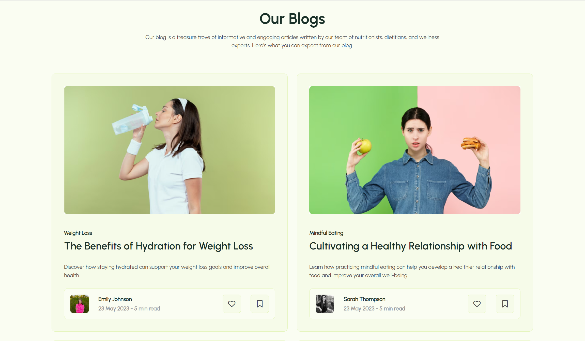
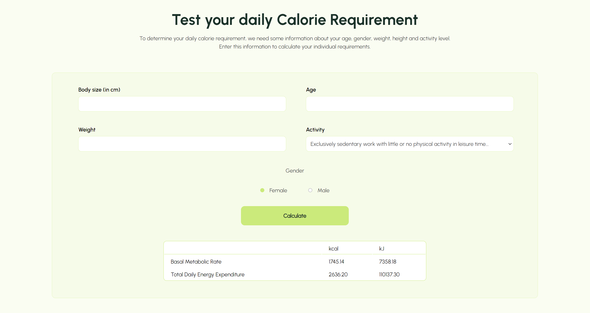
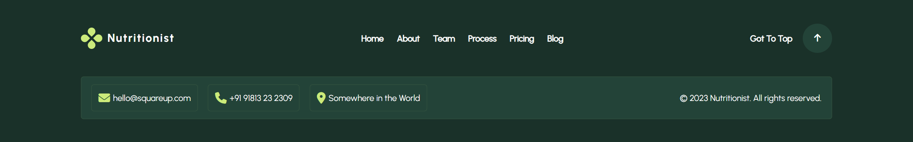

# Projekt: Frontend Health App

Dieses Projekt ermöglicht die Berechnung des täglichen Energiebedarfs (in Kilokalorien und Kilojoule) basierend auf den Benutzereingaben und enthält zusätzliche interaktive Funktionen wie sanftes Scrollen und die Auswahl des aktiven Tarifs.

## 🧰 Verwendete Technologien & Tools

- **HTML5** – zur Strukturierung der Webseite.
- **CSS3** – für das Design, Layout und Styling.
- **Responsive Design**:
  - Media Queries (`style.css`, `tablet.css`)
  - Anpassung für Tablet (bis 801px) und Mobile (bis 390px).
- **Flexbox & Grid** – zur modernen und flexiblen Layout-Gestaltung.
- **SCSS-ähnliche Struktur** – obwohl SCSS nicht direkt verwendet wurde, ist die Strukturierung und Wiederverwendbarkeit wie in SCSS aufgebaut.
- **JavaScript (ES6)** – für die Logik und Interaktivität:
  - Berechnung des Energiebedarfs (Basal Metabolic Rate).
  - Sanftes Scrollen zu bestimmten Bereichen der Seite.
  - Interaktive Umschaltung zwischen Monats- und Jahrestarif.
- **Font Awesome** – für Icons in Buttons und UI-Elementen.
- **Google Fonts: Urbanist** – für moderne Typografie.
- **VS Code** – als Entwicklungsumgebung.
- **Git & GitHub** – für Versionskontrolle und Veröffentlichung des Projekts.

## 🔧 Funktionen

### 🧮 Energiebedarfsrechner
- Eingaben: Größe, Alter, Gewicht, Geschlecht, Aktivitätsfaktor.
- Ausgabe: Tagesbedarf in kcal und kJ, mit und ohne Aktivitätsfaktor.

### 📜 Sanftes Scrollen
- Beim Klick auf einen Button scrollt die Seite sanft zu einem bestimmten Abschnitt.

### 💰 Tarifauswahl
- Benutzer kann zwischen "Monatlich" und "Jährlich" wählen.
- Sichtbare Anzeige der aktiven Tarifoption.

## 📱 Responsive Design
- Optimiert für:
  - Desktop (ab 970px)
  - Tablet (ab 740px – 970px)
  - Mobilgeräte (unter 740px)
- Unterschiedliche Layouts und Navigation für verschiedene Bildschirmgrößen.

## Kontaktinformationen

Falls Sie Fragen oder Vorschläge haben, können Sie mich kontaktieren:
- **E-Mail**: barshchevskak@gmail.com
- **GitHub**: [TinaBK24](https://github.com/TinaBK24)

## Screenshots

### Hore

### Features

### Blogs

### Calorie

### Footer

